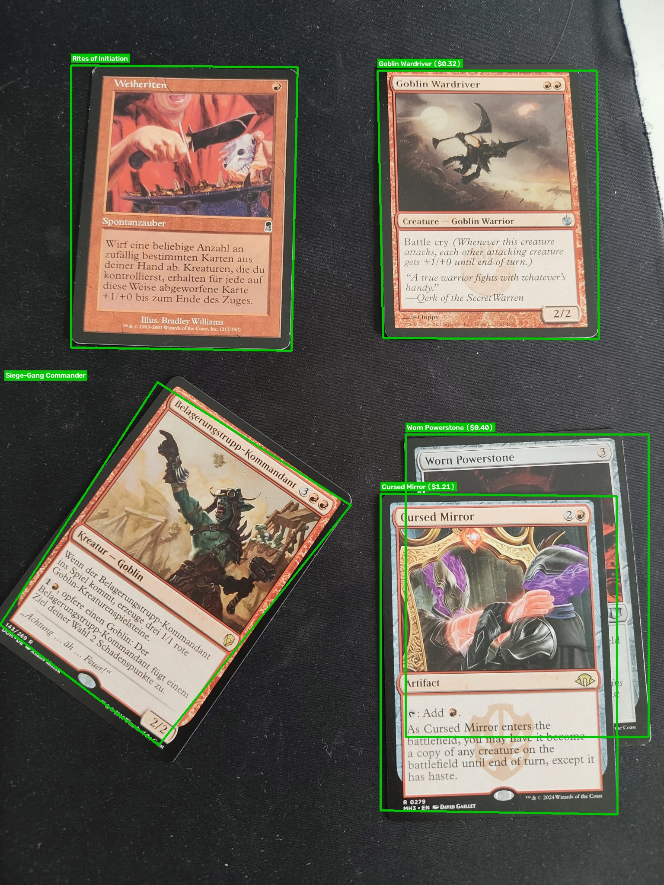

# MTG Card Scanner & Recognition Suite

An automated Magic: The Gathering card recognition pipeline powered by **Gemini 3.6 Flash Vision**, **OpenCV** perspective justification, and the **Scryfall API**.

The tool supports smartphone camera shots of isolated cards, binder pages, playmats, and stacked/cascaded deck piles across 3 primary operational modes.

---

## Visual Example: Detection & Overlay

Below is an example of the generated overlay showing recognized cards (green bounding boxes with live Scryfall pricing and foil tags) alongside unrecognized cards (red bounding boxes):

<p align="center">
  
</p>

---

## Features

- **Multi-Card Detection:** Detects single or multiple cards within a single image.
- **Perspective Justification:** Automatically detects card corners and warps skewed smartphone angles into rectified 450x628 crops.
- **Overlapping/Stacked Card Handling:** Detects partially visible cards in deck piles.
- **Hybrid Identification:** Combines exact Set Code + Collector Number matching, fuzzy string searching, and Scryfall autocomplete fallback.
- **Visual Validation:** Generates overview images with color-coded bounding polygons/boxes (Green = Matched, Red = Unmatched) and price overlays.
- **Moxfield Export:** Exports decklists formatted directly for Moxfield (e.g. `1 Sol Ring (MYS1) 187 *F*`) both to disk and straight to the terminal.
- **3 Application Modes:** Deck scanning (formatted text decklists), single-image card extraction, and bulk collection audits.

---

## Prerequisites

- Python 3.10+
- A Google Gemini API key ([Google AI Studio](https://aistudio.google.com/))

---

## Installation & Setup

### 1. Clone the Repository
```bash
git clone https://github.com/yourusername/mtg-card-scanner.git
cd mtg-card-scanner
```

### 2. Create and Activate a Virtual Environment
```bash
# macOS/Linux
python3 -m venv venv
source venv/bin/activate

# Windows (Command Prompt)
python -m venv venv
venv\Scripts\activate.bat

# Windows (PowerShell)
python -m venv venv
venv\Scripts\Activate.ps1
```

### 3. Install Required Dependencies
```bash
pip install google-genai opencv-python pillow pydantic requests python-dotenv
```

### 4. Configure Your API Key
Create a `.env` file in the root directory:
```bash
touch .env
```
Add your Gemini API key inside `.env`:
```env
GEMINI_API_KEY="AIzaSyYourActualKeyGoesHere"
GEMINI_MODEL="gemini-3.6-flash"
```

---

## Usage Guide

The script provides 3 distinct subcommands: `deck`, `cards`, and `collection`.

### 1. Deck Scan (`deck`)
Scans an image of a deck (including overlapping piles), aggregates card quantities, prints the Moxfield decklist directly in the terminal, and exports standard text and JSON manifests.

```bash
python mtg_scanner.py deck path/to/deck_photo.jpg --out output_deck
```

**Outputs:**
- Terminal: Formatted Moxfield import list
- `output_deck/decklist_moxfield.txt`: Moxfield format (e.g., `4 Lightning Bolt (CLB) 187`)
- `output_deck/decklist.txt`: Standard format (e.g., `4 Lightning Bolt`)
- `output_deck/deck_result.json`: Summary stats + structured card metadata
- `output_deck/<name>_annotated.jpg`: Annotated image with price labels
- `output_deck/<name>_crops/`: Individual justified card images

---

### 2. Cards Scan (`cards`)
Scans an image with one or more cards (e.g., binder page, spread on a table), justifies/crops each card, prints the Moxfield list, and resolves card details and prices.

```bash
python mtg_scanner.py cards path/to/im2.jpg --out output_cards
```

**Outputs:**
- Terminal: Formatted list of all detected cards
- `output_cards/cards_result.json`: Full card metadata and Scryfall IDs
- `output_cards/im2_annotated.jpg`: Labeled bounding boxes/polygons
- `output_cards/im2_crops/card_01.jpg`, `card_02.jpg`, ...

---

### 3. Collection Scan (`collection`)
Iterates over an entire directory of photos, runs the detection pipeline on each, prints the complete collection list, and exports a directory-wide summary audit showing recognized cards and unrecognized counts per image.

```bash
python mtg_scanner.py collection path/to/image_folder/ --out output_collection
```

**Outputs:**
- Terminal: Aggregated collection-wide Moxfield import list
- `output_collection/collection_moxfield.txt`: Full combined collection in Moxfield syntax
- `output_collection/collection_summary.json`: Aggregated metrics across all images:
  - Total images processed
  - Total cards detected / recognized / unrecognized
  - Per-image breakdown of recognized card names and error counts
- Annotated images and cropped cards for every photo in the input folder

---

## JSON Output Structure Example

```json
{
  "scenario": "deck_scan",
  "image": "photos/modern_burn.jpg",
  "total_cards_detected": 60,
  "recognized_cards_count": 59,
  "unrecognized_cards_count": 1,
  "moxfield_decklist": [
    "4 Lightning Bolt (CLB) 187",
    "4 Monastery Swiftspear (BRO) 144 *F*",
    "4 Rift Bolt (TSR) 188"
  ],
  "cards": [
    {
      "index": 1,
      "detected_raw": {
        "card_name_raw": "Lightning Bolt",
        "set_code": "CLB",
        "collector_number": "187",
        "is_partially_obscured": false,
        "is_foil": false,
        "box_2d": [120, 45, 410, 240]
      },
      "justified_image": "output_deck/modern_burn_crops/card_01.jpg",
      "matched": true,
      "scryfall": {
        "id": "f29ba16f-c8fb-42fe-aabf-87089cb214a7",
        "name": "Lightning Bolt",
        "mana_cost": "{R}",
        "type_line": "Instant",
        "set": "clb",
        "set_name": "Commander Legends: Battle for Baldur's Gate",
        "collector_number": "187",
        "rarity": "common",
        "price_usd": "0.74",
        "scryfall_uri": "https://scryfall.com/card/clb/187/lightning-bolt"
      }
    }
  ]
}
```

---

## Project Structure

```text
├── .env                       # Environment variable containing GEMINI_API_KEY
├── mtg_scanner.py             # Main CLI executable and processing engine
├── README.md                  # Documentation and setup instructions
└── output_cards/              # Destination for crops, JSON, and annotated photos
    ├── im2_annotated.jpg      # Labeled preview overlay image
    └── im2_crops/             # Rectified card crops
```

---

## Troubleshooting & Tips

- **Perspective Distortion:** For best results when photographing cards at steep angles, ensure all 4 card corners are in frame and well-lit.
- **Stacked Decks:** When photographing overlapping cards, ensure the top title bar and mana cost are visible.
- **Scryfall Rate Limits:** The script enforces a built-in 80ms delay between API queries and caches identical card lookups to respect Scryfall's API guidelines.
